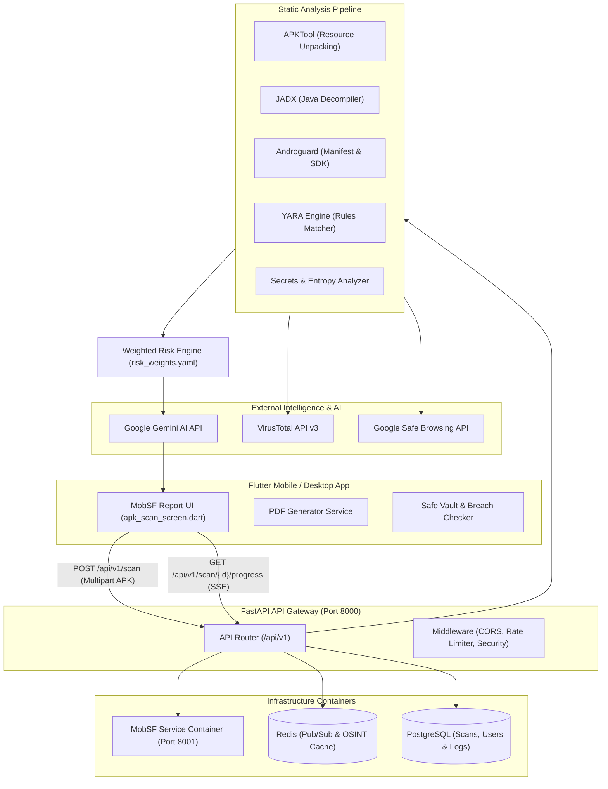

# ScamShield 🛡️

[](https://fastapi.tiangolo.com/)
[](https://flutter.dev/)
[](https://www.docker.com/)
[](https://mobsf.github.io/Mobile-Security-Framework-MobSF/)
[](https://www.python.org/)
[](LICENSE)

**ScamShield** is a comprehensive, enterprise-grade Mobile Application Security & Scam Detection Platform. It combines a sleek, modern Flutter mobile interface with a high-performance FastAPI backend orchestrating industry-standard static analysis tools (MobSF, JADX, APKTool, Androguard, YARA) alongside Explainable AI (Google Gemini) and Threat Intelligence (VirusTotal, Google Safe Browsing, AbuseIPDB).

---

## 🌟 Key Features

### 📱 MobSF-Style Interactive APK Security Report UI
- **Risk Score Dashboard**: Dynamic risk score card (0–100) with visual severity ratings (`LOW`, `MEDIUM`, `HIGH`, `CRITICAL`).
- **Explainable AI Intelligence**: Powered by Google Gemini 1.5/2.0, providing concise human-readable security breakdowns explaining *why* an application is suspicious.
- **File & Certificate Fingerprinting**: Extracts MD5, SHA-1, SHA-256 hashes, file sizes, and parses X.509 signer certificates.
- **Dangerous Permission Analyzer**: Interactive list categorizing Android permissions into high-risk and normal tiers using custom risk mapping ([permission_mapper.dart](file:///c:/Users/yashodhanrajapkar/Documents/ScamShield/lib/utils/permission_mapper.dart)).
- **Hardcoded Secret & API Key Extractor**: Scans decompiled DEX/DSO sources for leaked AWS keys, JWT tokens, Bearer tokens, private keys, and database credentials.
- **URL & Tracker Extraction**: Identifies hardcoded HTTP/HTTPS endpoints, webhooks, and third-party tracking URLs.
- **Executive PDF Report Export**: Export detailed, publication-ready PDF security audits directly from the device ([report_generator_service.dart](file:///c:/Users/yashodhanrajapkar/Documents/ScamShield/lib/services/report_generator_service.dart)).

### 🔍 Multi-Tool Static Analysis Pipeline
- **MobSF (Mobile Security Framework)**: Seamless integration via REST API to execute containerized static binary scans.
- **APKTool & JADX Decompiler**: Manifest unpacking, resource extraction, and DEX-to-Java source code decompilation.
- **Androguard Engine**: Deep structural analysis of APK manifest components (Activities, Services, Receivers, Providers) and permissions.
- **YARA Malware Rule Matching**: Signature-based detection using customizable YARA security rules ([sample_rules.yar](file:///c:/Users/yashodhanrajapkar/Documents/ScamShield/backend/yara_rules/sample_rules.yar)).
- **Automated Caching & Deduplication**: Fast SHA-256 hash lookup in PostgreSQL to instantly return cached security reports for previously analyzed APKs.

### 🛡️ Threat Intelligence & OSINT Correlation
- **VirusTotal API v3 Integration**: Cross-references APK file hashes against 70+ antivirus engines.
- **Google Safe Browsing API**: Validates extracted domain names and URLs against live malicious site databases.
- **AbuseIPDB Querying**: Checks extracted IP addresses for past abuse reports and threat history.

### 💬 Multimodal Scam Detection
- **Text Scam Analysis**: Real-time evaluation of SMS, phishing links, and suspicious text messages.
- **Voice Scam Analysis**: Speech-to-text transcription powered by OpenAI Whisper coupled with scam intent detection.
- **Image/Screenshot OCR**: Text extraction from screenshots using EasyOCR to catch banking scams and fake alert overlays.

---

## 🏗️ System Architecture



---

## 📁 Repository Structure

```
ScamShield/
├── android/                         # Android native runner configuration
├── ios/                             # iOS native runner configuration
├── lib/                             # Flutter Mobile Application Source Code
│   ├── main.dart                    # Application entrypoint & theme initialization
│   ├── screens/                     # UI screens
│   │   ├── apk_scan_screen.dart     # MobSF-style APK report & analysis screen
│   │   ├── home_screen.dart         # Main dashboard & quick scan launcher
│   │   ├── history_screen.dart      # Historical scan records
│   │   ├── breach_screen.dart       # OSINT breach search
│   │   ├── learn_screen.dart        # Cyber awareness education modules
│   │   ├── safe_vault_screen.dart   # On-device secret scanner
│   │   └── profile_screen.dart      # User settings & API metrics
│   ├── services/                    # Frontend services & API integration
│   │   ├── apk_analyzer_service.dart# Local APK analysis fallback
│   │   ├── report_generator_service.dart # PDF report creation engine
│   │   ├── scanner_service.dart     # FastAPI scan endpoint client
│   │   ├── osint_service.dart       # OSINT threat query client
│   │   └── permission_service.dart  # Native device permission handler
│   └── utils/
│       └── permission_mapper.dart   # Android permission categorization dictionary
├── backend/                         # Production FastAPI Backend & Analyzers
│   ├── app/
│   │   ├── main.py                  # FastAPI app factory, middleware, CORS
│   │   ├── api/v1/                  # API routers (health, analyze, image, voice, batch)
│   │   ├── routes/
│   │   │   └── scan.py              # Main APK scan route handler & orchestrator
│   │   ├── analyzers/               # Core static analysis engines
│   │   │   ├── apktool.py           # Manifest & resource unpacker
│   │   │   ├── jadx.py              # Java decompiler wrapper
│   │   │   ├── androguard_analyzer.py # Structural DEX & permission parser
│   │   │   ├── secrets_analyzer.py  # RegEx & entropy secret detection
│   │   │   └── yara_analyzer.py     # YARA signature matcher
│   │   ├── services/                # Business logic services
│   │   │   ├── mobsf.py             # MobSF REST client integration
│   │   │   ├── risk_engine.py       # Custom weighted risk scoring engine
│   │   │   ├── ai_explanation.py    # Gemini AI integration service
│   │   │   ├── osint.py             # Threat intel aggregator (VT, AbuseIPDB, GSB)
│   │   │   └── progress.py          # Real-time scan progress tracker
│   │   ├── config/
│   │   │   └── risk_weights.yaml    # Configurable risk severity weights
│   │   ├── reports/
│   │   │   └── generator.py         # Server-side PDF/JSON report builder
│   │   └── models/                  # SQLAlchemy ORM schemas
│   ├── docker/                      # Containerization setup
│   │   ├── Dockerfile               # Backend python container spec
│   │   └── docker-compose.yml       # Full stack compose file (API, MobSF, DB, Redis)
│   ├── yara_rules/                  # Security signature rules
│   └── test_apks.py                 # Automated backend QA test suite
└── docs/                            # Detailed technical documentation
    ├── INSTALLATION_GUIDE.md        # Environment setup guide
    ├── PROJECT_REPORT.md            # Architectural design report
    └── USER_MANUAL.md               # User guide & operations
```

---

## ⚡ Quick Start & Installation Guide

### Prerequisites
- **Flutter SDK**: 3.19.0 or later
- **Docker & Docker Compose**: Docker Desktop 4.x+
- **Python**: 3.12+ (for local backend development outside Docker)
- **Java JDK**: 17+ (required for local JADX / APKTool operations)

---

### Step 1: Environment Configuration

Copy the example environment file and configure required keys:

```bash
cd backend
cp docker/.env.example .env
```

Edit `backend/.env` to configure your API keys:

```env
# Required for Explainable AI
GEMINI_API_KEY=your_gemini_api_key_here

# Threat Intelligence (Optional but recommended)
VIRUSTOTAL_API_KEY=your_virustotal_key
GOOGLE_SAFE_BROWSING_KEY=your_google_key
ABUSEIPDB_API_KEY=your_abuseipdb_key

# Infrastructure Secrets
POSTGRES_USER=scamshield
POSTGRES_PASSWORD=scamshield_password
POSTGRES_DB=scamshield
MOBSF_API_KEY=mobsf_api_key_123
```

---

### Step 2: Launch Backend Stack with Docker

Start all microservices (FastAPI, MobSF, PostgreSQL, Redis) via Docker Compose:

```bash
cd backend/docker
docker compose up -d --build
```

Verify running services:

```bash
docker compose ps
```

| Service | Host URL | Description |
| :--- | :--- | :--- |
| **ScamShield API** | `http://localhost:8000` | FastAPI Backend Gateway |
| **Interactive Docs** | `http://localhost:8000/docs` | Swagger OpenAPI UI |
| **MobSF Engine** | `http://localhost:8001` | Mobile Security Framework Dashboard |
| **PostgreSQL** | `localhost:5432` | Async database engine |
| **Redis** | `localhost:6379` | Cache & PubSub broker |

---

### Step 3: Run the Flutter Mobile Application

1. **Install Flutter Dependencies:**
   ```bash
   flutter pub get
   ```

2. **Run Native App (Android / iOS / Windows):**
   ```bash
   flutter run
   ```

> **Note for Android Emulator:** The Flutter app connects to `http://10.0.2.2:8000` by default when running on the Android Emulator to reach the host FastAPI container.

---

## 🔌 API Reference & Endpoints

### 1. APK Security Scanning

| Method | Endpoint | Description |
| :--- | :--- | :--- |
| `POST` | `/api/v1/scan` | Upload APK file (`multipart/form-data`) and run full static analysis pipeline. Returns full scan report JSON. |
| `GET` | `/api/v1/scan/{scan_id}` | Fetch previous scan results by ID or SHA-256 hash. |
| `GET` | `/api/v1/scan/{scan_id}/progress` | Server-Sent Events (SSE) live progress stream during scan execution. |
| `GET` | `/api/v1/scan/{scan_id}/report.pdf` | Download formatted MobSF-style PDF security report. |

### 2. Multimodal Scam Analysis

| Method | Endpoint | Description |
| :--- | :--- | :--- |
| `POST` | `/api/v1/analyze` | Text scam detection powered by Gemini AI + heuristic rule engine. |
| `POST` | `/api/v1/analyze-voice` | Upload audio file for Whisper transcription and scam evaluation. |
| `POST` | `/api/v1/analyze-image` | Upload screenshot image (PNG/JPG/PDF) for EasyOCR text extraction and security analysis. |
| `POST` | `/api/v1/analyze-batch` | Batch process up to 50 text messages concurrently. |
| `GET` | `/api/v1/health` | Comprehensive health check returning database, Redis, MobSF, and Gemini service status. |

---

## 🧪 Automated Testing & Quality Assurance

### Run Backend Integration Tests
Execute the end-to-end QA test suite against test APK binaries:

```bash
cd backend
python test_apks.py
```

### Run Flutter Unit & Widget Tests
```bash
flutter test
```

---

## 🛡️ Risk Engine Scoring Rules

ScamShield evaluates APK security risks on a 0 to 100 scale using a weighted scoring matrix defined in [risk_weights.yaml](file:///c:/Users/yashodhanrajapkar/Documents/ScamShield/backend/app/config/risk_weights.yaml):

- **Dangerous Permissions**: Weighted by criticality (e.g., `SEND_SMS`, `SYSTEM_ALERT_WINDOW`, `RECEIVE_BOOT_COMPLETED`, `READ_CONTACTS`).
- **Hardcoded Secrets**: Detection of API keys, AWS tokens, private keys (+15 points per critical secret).
- **YARA Rule Matches**: Signature matches (+20 points per match).
- **VirusTotal Malicious Detections**: Scored based on total engine detections.
- **Untrusted Certificates**: Self-signed or debug certificates (+10 points).

| Risk Score | Risk Level | Recommendation |
| :---: | :---: | :--- |
| `0 - 25` | **LOW** | Safe to install and use. |
| `26 - 55` | **MEDIUM** | Exercise caution; review requested permissions. |
| `56 - 80` | **HIGH** | Dangerous app; high risk of privacy violation or scam activity. |
| `81 - 100` | **CRITICAL** | Severe malware / spyware threat; do not install! |

---

## 📚 Technical Documentation

For deeper architectural details, setup guides, and user manuals, refer to the `docs/` directory:
- 📖 [Installation & Deployment Guide](docs/INSTALLATION_GUIDE.md)
- 🏗️ [Project Technical Report](docs/PROJECT_REPORT.md)
- 📱 [User Operating Manual](docs/USER_MANUAL.md)

---

## 📄 License

This project is licensed under the MIT License — see the [LICENSE](LICENSE) file for details.
